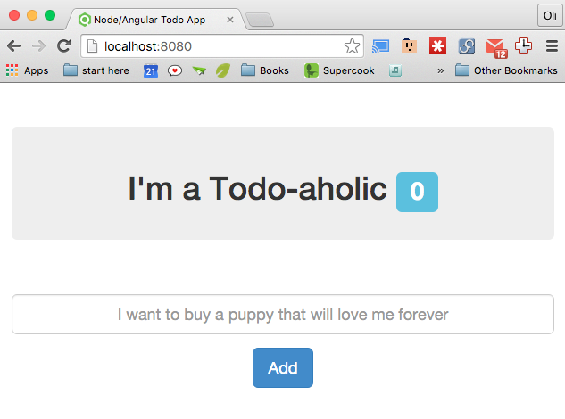

### As now I am having trouble getting this to work with my own remote MongoLabs or Modulus DB. I have tried bringing in my own URL and was able to connect remotely. I'm not sure why it wouldn't connect as easily as the tutorial suggested.

This includes work from a scotch.io tutorial that ends up looking like this

Forks of this will show the further modifications I've made to it.

You can view a working version of the application on [heroku](https://node-to-do-list-2016jan20.herokuapp.com/)
